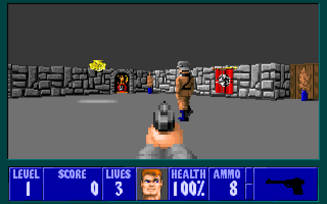

# Cub3D

## 🗣️ About

Cub3D is a project from the cursus of School 42. 

The goal is to make a little 3D game engine which is based on Ray Casting. It will render a 3D environment that ressembles an old school video games such as Duke Nukem or Doom.



## 🎮 Gameplay

This is quite simple ! 

-> Use ```W``` ```A``` ```S``` ```D``` to navigate the map. <br>
-> Pressing ```space``` will makes you run. <br>
-> Pressing the red cross or ```ESCAPE``` will close the window. <br>

A minimap is provided to help you navigate the map. 

## 🛠️ Usefool Resources

-> A good tutorial about Ray Casting implementation : https://permadi.com/1996/05/ray-casting-tutorial-table-of-contents/ <br>
-> How to use the mlx : https://harm-smits.github.io/42docs/libs/minilibx/getting_started.html <br>

## 💿 Compilation and execution

To compile the program, execute the Makefile command ```make``` and execute it with ```./cub3d <relative_path_to_map>```

## 🗑️ Deletion

To destroy the executable and obj files, use ```make fclean```. To only destroy obj files without destroying the executable, use ```make clean```. 

## ✅ Validation

The project has been validated with a final mark of 110/100 (with bonus). 
